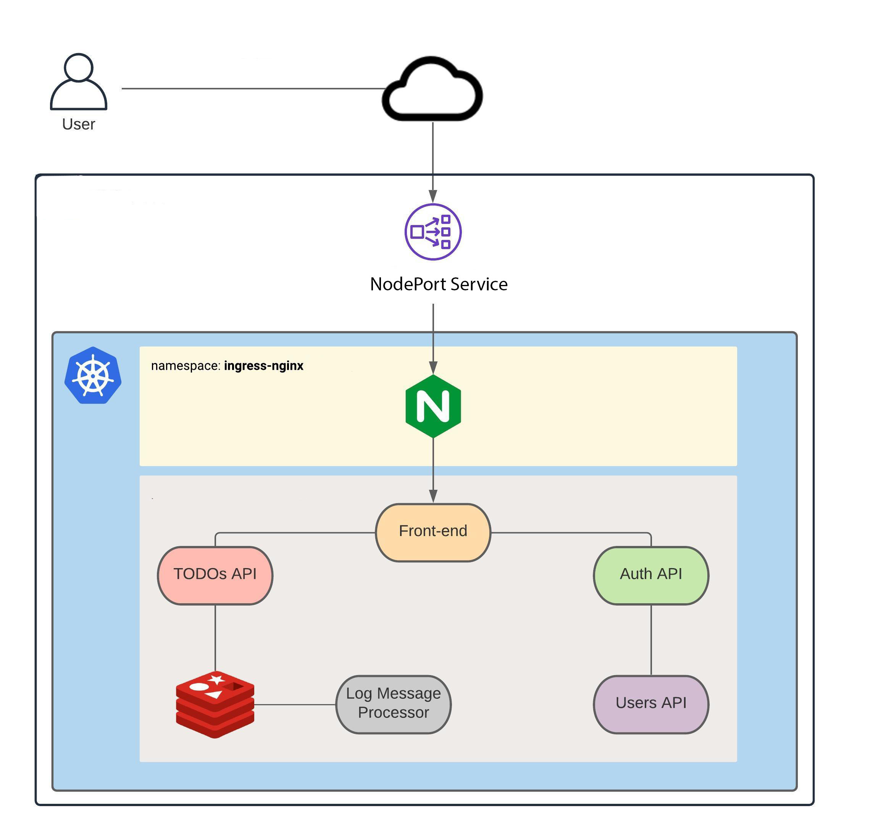

# Kubernetes Deployment for Multi-Service Application

## Overview
This project deploys a multi-service application on a Kubernetes cluster. The application includes a frontend, APIs, a Redis instance for caching, and a log message processor. The ingress traffic is managed by **NGINX Ingress Controller**, and the frontend is exposed via a **NGINX Ingress**. **Kubernetes Network Policies** to enhance security and control traffic flow within the cluster.

## Architecture 
<div style="text-align: center;">
  
</div>

- **Frontend:** Handles user interface and interacts with the backend services.
- **TODOs API:** Manages task-related operations and interacts with Redis for caching.
- **Auth API:** Handles user authentication.
- **Users API:** Manages user-related data.
- **Log Message Processor:** Processes logs and events within the system.
- **Redis:** Used for caching to optimize performance.
- **NGINX Ingress Controller:** Manages routing of external traffic to services in the cluster.

## Prerequisites
1. Kubernetes cluster (v1.30 or higher).
   If not, you can follow my guide to auto-install Kubernetes cluster [here](ansible/README.md).
2. Helm installed on your local machine.
3. `kubectl` CLI configured to interact with the Kubernetes cluster.

## Deployment Steps

### Step 1: Deploy NGINX Ingress Controller
   ```bash
    helm upgrade --install ingress-nginx ingress-nginx \
    --repo https://kubernetes.github.io/ingress-nginx \
    --namespace ingress-nginx --create-namespace \ 
    --set controller.service.type=NodePort 
```
### Step 2: Deploy Application
```bash
    kubectl apply -f ./manifests/app/auth-api/.
    kubectl apply -f ./manifests/app/frontend/.
    kubectl apply -f ./manifests/app/redis-queue/.
    kubectl apply -f ./manifests/app/todos-api/.
    kubectl apply -f ./manifests/app/user-api/.
    kubectl apply -f ./manifests/app/log-message-processor/.
    kubectl apply -f ./manifests/app/dns-network-policy/.
```
### Step 3: Verity Deployment
```bash
    kubectl get all -n todoapp
```

## Directory Structure

- ansible
  - playbooks
  - hosts
  - README.md
- auth-api
- frontend
- log-message-processor
- manifest
  - app
    - auth-api
    - dns-network-policy
    - frontend
    - log-message-processor
    - redis-queue
    - todos-api
    - users-api
  - installation  
- todos-api
- users-api

## Furute Improvements
1. Implement CI/CD pipelines for automated deployment.
2. Add monitoring and logging tools like Prometheus and Grafana.